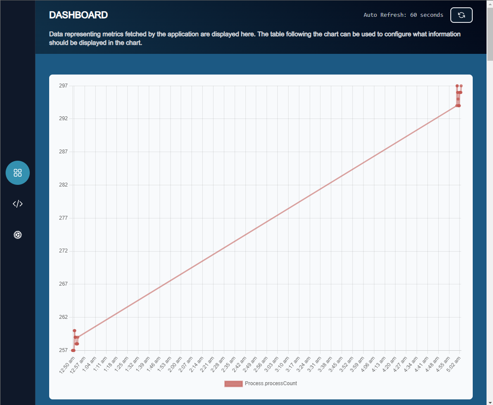

# Metrics Fetcher

## Overview

This is a software is designed to integrate real-time monitoring capabilities and machine learning methodologies on windows computers to aid in detection of hardware components affecting the computer.

## Features

- Real-time monitoring of hardware components
- Proactive alerts
- Insights into component behavior over time
- Web UI
- Monitoring custom hardware components via JavaScripting interface

## Installation

The software was built using MSBuild on Visual studio 2022 (X64). Other compilers should be able to build this project, with the caveat that this is only supports Windows.

Alternatively, you can clone the repo and copy the folder `x64/Release` this folder contains an executable which you can quickly run on your computer.

## Contributing

If you find any issues or have suggestions for improvements, please submit a pull request or open an issue on GitHub.

## License

This project is licensed under the [MIT License](./LICENSE).

## Contact

For inquiries or support, please [raise an issue on Github](https://github.com/eikcalb/metricsfetcher/issues/new).
